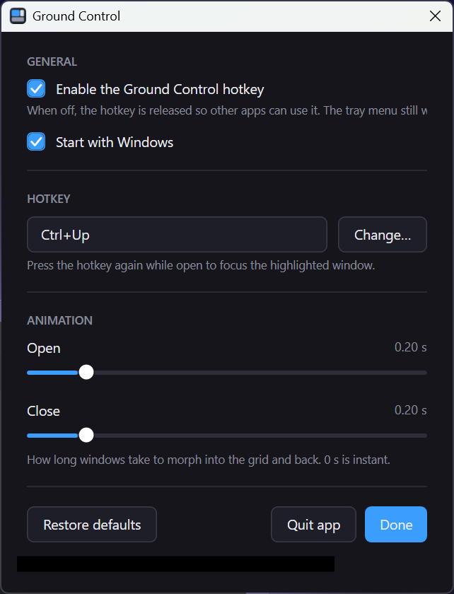

# Ground Control

A prototype that brings macOS-style **Mission Control / Exposé** to Windows: press a
hotkey and every open window smoothly shrinks into an organic layout. Move the
highlight with the arrow keys, then press the hotkey again (or Enter) to jump to that window.


A tray icon will be added to control Ground Control, with more settings available upon right-click.




## Requirements

- Windows 10/11
- .NET SDK 9 with the WindowsDesktop runtime

No third-party packages — only built-in Windows APIs (`user32`, `dwmapi`).

## Install

Run `dist/GroundControl-Setup-<version>.exe` (built by `build/build-installer.ps1`). It
installs per-user into `%LOCALAPPDATA%\Programs`, needs no admin rights, and bundles the
.NET runtime, so nothing else has to be installed first.

## Run from source

```sh
dotnet run --project src/GroundControl/GroundControl.csproj
```

The app lives in the notification area — right-click its icon for **Settings…**, where the
hotkey, the open/close animation lengths and "start with Windows" can be changed. Defaults:

| Keys | Action |
|------|--------|
| `Ctrl+Up` | Open the overlay / focus the highlighted window |
| Arrows, `Tab` | Move between windows |
| `Enter` or click | Focus a window |
| `Esc` | Dismiss |
| `Ctrl+Alt+Shift+Q` | Quit |

See [CLAUDE.md](CLAUDE.md) for architecture and design notes.
